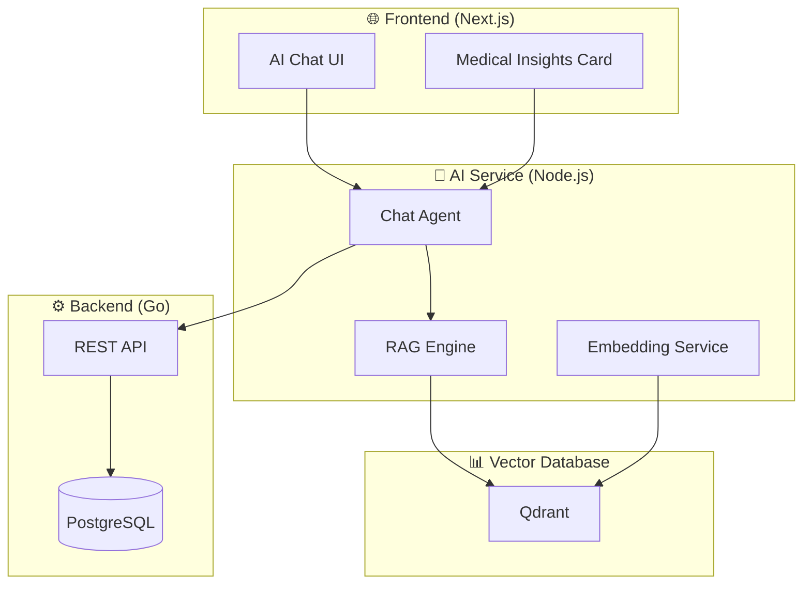
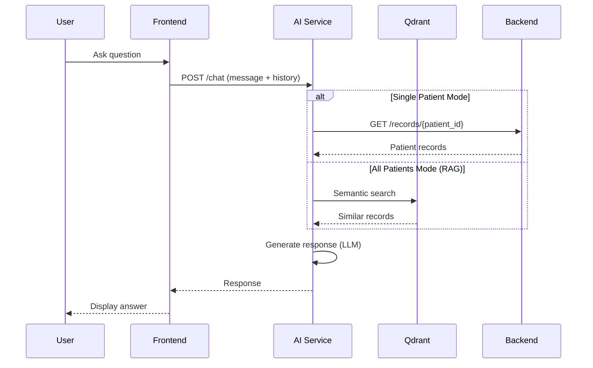

# VanguardHealth AI Agents Architecture

## Overview

VanguardHealth ใช้ระบบ AI Agents ที่ทำงานร่วมกันเพื่อให้บริการด้านสุขภาพอัจฉริยะ



---

## Agents

### 1. Chat Agent (`/chat`)

**หน้าที่**: ตอบคำถามเกี่ยวกับสุขภาพและวิเคราะห์ข้อมูลผู้ป่วย

| Feature | Description |
|---------|-------------|
| **Model** | Llama 3.3 70b (via Groq) |
| **Framework** | LangGraph + LangChain |
| **Memory** | ✅ จำบทสนทนา 10 ข้อความล่าสุด |
| **Context** | Patient records + demographics |

**Modes**:
- **Single Patient**: ดึงข้อมูลผู้ป่วยเฉพาะรายจาก PostgreSQL
- **All Patients (RAG)**: Semantic search ข้าม Qdrant เพื่อหาผู้ป่วยที่เกี่ยวข้อง

```javascript
// Request format
{
  message: "คนไข้คนนี้มีอาการอะไร?",
  patient_id: "P001",
  conversation_history: [...],  // Last 10 messages
  patient_context: { name, gender, dob }
}
```

---

### 2. RAG Engine (Retrieval-Augmented Generation)

**หน้าที่**: ค้นหาข้อมูลสุขภาพที่เกี่ยวข้องโดยใช้ Semantic Search

| Component | Technology |
|-----------|------------|
| **Embedding Model** | Gemini text-embedding-004 (768 dim) |
| **Vector Store** | Qdrant |
| **Search Method** | Cosine Similarity |

**Flow**:
1. User query → Generate embedding
2. Search Qdrant for similar records
3. Return top-k results with relevance scores
4. Feed to Chat Agent as context

---

### 3. Embedding Service (`/vectorize`, `/embed`)

**หน้าที่**: แปลงข้อมูลสุขภาพเป็น vectors สำหรับ semantic search

```javascript
// Vectorize health record
POST /vectorize
{
  record_id: "uuid",
  patient_id: "P001", 
  record_type: "vitals",
  data: { blood_pressure: "120/80", ... }
}
```

---

### 4. Medical Insights Agent (Frontend Component)

**หน้าที่**: วิเคราะห์แนวโน้มสุขภาพและให้คำแนะนำอัตโนมัติ

**Location**: `MedicalInsightsCard` component in `page.tsx`

**Prompt Template**:
```text
Analyze health records and provide:
1. Key health trends
2. Potential risk factors  
3. Recommended actions

[Language: Thai/English based on locale]
```

---

## Data Flow



---

## Environment Variables

| Variable | Service | Description |
|----------|---------|-------------|
| `GROQ_API_KEY` | AI | Llama 3.3 70b API key |
| `GEMINI_API_KEY` | AI | Embedding model API key |
| `QDRANT_URL` | AI | Vector database URL |
| `BACKEND_URL` | AI | Go backend URL |

---

## Future Agents (Roadmap)

- [ ] **Diagnosis Suggestion Agent** - แนะนำการวินิจฉัยจากอาการ
- [ ] **Drug Interaction Checker** - ตรวจสอบความเสี่ยงยาตีกัน
- [ ] **Appointment Scheduler Agent** - ช่วยนัดหมาย
- [ ] **Voice Input Agent** - รับคำสั่งด้วยเสียง
